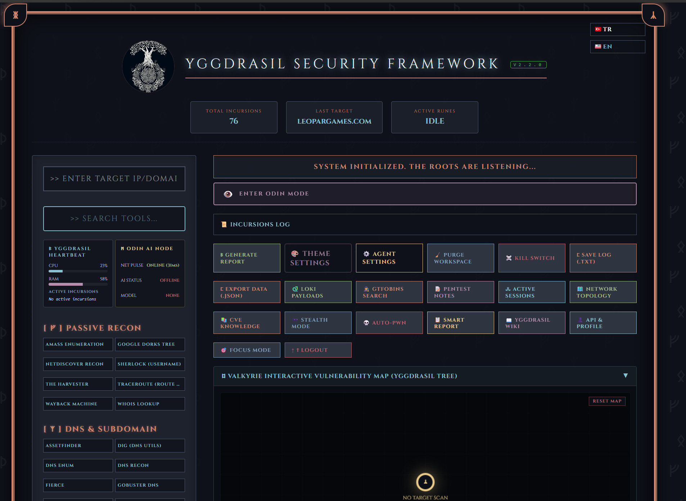

# ᚛᚜ Yggdrasil Security Framework v2.2.0 ᚛᚜



[ 🇬🇧 English ](#-english) | [ 🇹🇷 Türkçe ](#-türkçe)

---

### 🚀 What's New in v2.2.0
- **Application Factory (`create_app`)**: Test edilebilir ve deploy edilebilir Flask uygulaması
- **C2 SQLite Persistence**: Listener ve zombie session'ları veritabanında kalıcı
- **Kritik Güvenlik Düzeltmeleri (32 adet)**: Deadlock, sabit anahtarlar, XSS koruması, input validation
- **Kapsamlı Test Altyapısı (42 dosya, 225+ test, 0 FAIL)**: Birim, entegrasyon, güvenlik, frontend, fuzzing testleri
- **GitHub Actions CI Pipeline**: Otomatik lint + pytest + coverage
- **Runes Alt Proje Paketleme**: 12 alt proje bağımsız `pyproject.toml` ile paketlenebilir
- **JSON Login Desteği**: `/login` endpoint'i artık hem form-data hem JSON kabul ediyor
- **Automated UI Testing Framework**: Selenium + Chrome headless ile otomatik arayüz testleri (`test_frontend.py`)
- **Smart Report Generation (AI-Powered)**: Valkyrie — CVSS skorlu, LLM destekli profesyonel güvenlik raporları (`handlers/valkyrie_reporter.py`)
- **Auto-Pwn Engine (Odin Agent)**: Otonom sızma testi — ReAct karar döngüsü, native tool calling (`handlers/agent_loop.py`)
- **Modular JavaScript Architecture**: Complete refactoring of `api.js` into modular components for massive performance gains, cleaner code, and synchronous load fixes.
- **Loki WAF Evader AI**: Brand new intelligent WAF bypass payload generator with deep AI context.
- **Attack Graph Upgrades**: Real-time rendering fixes and asynchronous topology generation.
- **XSS Protection**: Strengthened Kvasir AI Chat outputs with HTML escaping.
- **Stealth Mode (OPSEC)**: Obfuscates footprints, regulates scan intensity, and masks network traffic.
- **Active Sessions & Metasploit Tracker**: Tracks C2 connections, reverse shells, and active exploit sessions in real-time.
- **Network Topology Visualizer**: Generates dynamic, interactive node graphs of the target network architecture.
- **Focus / Zen Mode (Hack Mode)**: Immersive, distraction-free terminal layout with pitch-black UI for deep hacking sessions.


## 🇬🇧 English

This repository features an advanced security reconnaissance and vulnerability assessment framework developed to centralize offensive security operations. It integrates industry-standard tools into a unified, Norse-themed dashboard to streamline the information gathering and exploitation phases of a penetration test.

### Project Reflection & Technical Q&A

#### 1. Why did I write the code this way? (XYZ Analysis)
* My objective was to eliminate the inefficiency of switching between multiple command-line tools during a security audit. 
* I accomplished a centralized, web-based management system as measured by reducing tool initialization and reporting time by integrating a Python Flask backend with a dynamic Runic Dashboard. 
* This ensures that reconnaissance data is visualized and logged in real-time within a cohesive operational environment.

#### 2. What challenges did I face?
* **Subprocess Management & Async Architecture**: Initially, running intensive scans via `subprocess.Popen` or `check_output` blocked the Flask worker threads, causing the frontend to hang. To solve this, I designed an **Asynchronous Task Manager** (`uuid` based polling). The frontend fires a request, receives a `task_id` in a `pending` state, and dynamically polls a `/api/task_status` endpoint without freezing the UI. This allows multiple reconnaissance modules to execute truly concurrently.
* **Cross-Platform Process Termination**: A major challenge was cleanly killing deep-running asynchronous scans directly from the UI without leaving orphan processes. I engineered a thread-tracking mechanism in Python mapped to `psutil`, which allows the framework to recursively terminate any tool and its child processes across Windows, Linux, and macOS whenever a user clicks the abort (X) button on the web terminal.
* **Dependency Orchestration & WSL Integration**: I implemented a "Runic Installation Ritual" to detect missing system tools dynamically. On Windows platforms, the framework intelligently queries the **Windows Subsystem for Linux (WSL)** (`wsl.exe --list`), allows users to configure their preferred WSL distribution via the UI, and automatically routes Linux-native security tool execution through the `wsl.exe -d <distro> -u root --` pipeline.
* **Smart Authentication**: Implemented a caching mechanism (`.yggdrasil_auth`) for the startup scripts (`run.bat`/`run.sh`), ensuring the framework only prompts for the master password once upon initial setup.
* **Output Streaming**: Implementing the typewriter effect for real-time output rendering was a challenge in managing asynchronous JavaScript data streams within a synchronous HTML environment.

#### 3. How did I manage the Security Arsenal?
* **Modular Integration**: I architected a modular command execution engine that handles specialized flags for Nmap, Sqlmap, Nikto, and WPScan to ensure optimal scan accuracy.
* **Artifact Logging**: The framework includes a reporting module that sanitizes terminal output and exports it into structured TXT or JSON artifacts for professional security documentation.

---

### ᚛᚜ Complete Integrated Arsenal & Features ᚛᚜

The Yggdrasil Security Framework integrates **40+ core features and modules** divided into 10 distinct tactical categories:

| Runic Category | Tool Name | Description | Target Req. | OS Support | Command / Handler |
| :--- | :--- | :--- | :---: | :---: | :--- |
| **Passive Reconnaissance (ᚠ)** | WHOIS Lookup | Domain registration information retrieval | Yes | Linux/Win | `whois {target}` |
| | The Harvester | Email, subdomain, and host intelligence gathering | Yes | Linux/Win | `theHarvester -d {target} -l 100 -b all` |
| | Amass Enumeration | Deep open-source subdomain scanning | Yes | Linux/Win | `amass enum -d {target} -passive` |
| | Sherlock | Search social accounts by username | Yes | Linux/Win | `sherlock {target} --timeout 5` |
| | Google Dorks Tree | Interactive dork search links (admin/login/indexes/PDFs...) | Yes | Custom | `generate_dorks` handler |
| | Wayback Machine | Query archive.org for past URLs and cached endpoints | Yes | Custom | `wayback` handler |
| **DNS & Subdomain (ᛉ)** | DNS Enum | Locate DNS records and subdomains | Yes | Linux | `dnsenum --noreverse {target}` |
| | Subfinder | Fast passive subdomain enumeration | Yes | Linux/Win | `subfinder` handler |
| | Assetfinder | Lightweight subdomain discovery | Yes | Linux/Win | `assetfinder --subs-only {target}` |
| | Fierce | IP block and zone-transfer DNS scanner | Yes | Linux/Win | `fierce --domain {target}` |
| | Knockpy | Brute-force DNS subdomain scanner | Yes | Linux/Win | `knockpy` handler |
| | Gobuster DNS | Fast brute-force subdomain discovery | Yes | Linux/Win | `gobuster_dns` handler |
| | Nslookup | Built-in DNS query utility | Yes | Linux/Win | `nslookup -type=any {target}` |
| | Sublist3r | Fast multi-engine subdomain enumeration | Yes | Linux/Win | `sublist3r -d {target}` |
| | DNS Recon | Advanced DNS discovery and AXFR query tool | Yes | Linux/Win | `dnsrecon -d {target}` |
| | Dig (DNS Utils) | Direct query utility for DNS records | Yes | Linux/Win | `dig ANY {target}` |
| **Active Scanning (ᛦ)** | Nmap (Full Scan) | Rapid service identification and port scanning | Yes | Linux/Win | `nmap -sV -F --version-light {target}` |
| | WAF Detection | Detect and identify Web Application Firewalls (Wafw00f) | Yes | Linux/Win | `wafw00f {target}` |
| | Packet Sniffer | Capture network traffic using live Tshark stream | Yes | Linux/Win | `tshark -c 5 -i any` |
| | Nikto Web Scan | Scan target web servers for dangerous files and outdated software | Yes | Linux | `nikto -h {target} -Tuning 1` |
| | WPScan | WordPress vulnerability enumeration & user scan | Yes | Linux | `wpscan --url {target} --enumerate p --random-user-agent` |
| **Vulnerability (ᛟ)** | Exploit-DB Search | Offline check for local exploit binaries (Searchsploit) | Yes | Linux | `searchsploit {target}` |
| | Lynis (System Hardening) | Security auditing and system hardening tool | No | Linux | `lynis audit system` |
| | Nuclei (Vuln Scanner) | Fast and customizable vulnerability scanner | Yes | Linux/Win | `nuclei -u {target}` |
| | Wapiti (Web Scanner) | Web application vulnerability scanner | Yes | Linux/Win | `wapiti -u {target}` |
| | Nmap (CVE Vulners) | Nmap scan using Vulners script | Yes | Linux/Win | `nmap -sV --script vulners {target}` |
| | Hydra (Brute Force) | Parallelized network login cracker | Yes | Linux/Win | `hydra_bruteforce` handler |
| | Sqlmap | Automate detection and exploitation of SQL injection | Yes | Linux/Win | `sqlmap -u {target} --batch --banner` |
| | Commix | Automated command injection vulnerability scanner | Yes | Linux/Win | `commix --url {target} --batch` |
| | Fenrir Hash Cracker | Advanced GPU/CPU (AVX2/OpenCL) accelerated password hash auditor. | Yes | Linux/Win | `fenrir_handler` |
| **Erebus Scanner (Rust) (ᛥ)** | Erebus Scanner | Multi-threaded port scanner with banner grabbing, proxy routing, and IDS evasion | Yes | Linux/Win | `cargo run --manifest-path Runes/erebus-scanner/Cargo.toml` |
| **Kali Ghost Scripts (ᚷ)** | MAC Değiştir | Spoof network interfaces with random MAC | No | Linux | `bash Runes/mac_degistir.sh` |
| | Kimlik Sorgula | Query current public metadata & geolocate | No | Linux | `bash Runes/sorgula.sh` |
| | Yeni IP (Tor) | Renew active IP addressing on Tor circuits | No | Linux | `bash Runes/yeni_ip.sh` |
| **Advanced SYN Scanning (ᛋ)** | Advanced SYN Scan | High speed custom TCP SYN port scanner | Yes | Linux | `Runes/Advanced-SYN-Scanner/syn_scanner` |
| **GUI Traffic Analyzer (ᛈ)** | Launch GUI Sniffer | Maven-compiled JavaFX graphic packet analysis UI | No | Linux/Win | `mvn javafx:run` (in sniffer dir) |
| **Mimir Scanner (ᛗ)** | Mimir Scanner | Real-time network traffic analyzer (Java Spring Boot + React) | No | Linux/Win | `mimir_scanner` handler |
| **SnoopDork OSINT V3 (ᛞ)** | Launch SnoopDork OSINT | Dynamic Target-Oriented OSINT Dork Generator | No | Linux/Win | Browser-based GUI |
| **Packet Injector (ᛇ)** | Packet Injector | Raw packet crafter, TCP SYN/ARP injector, and sniffer engine | Yes | Linux | `sudo python3 Runes/packet-injector/main.py` |
| **Bifrost Gateway (ᛒ)** | Bifrost Gateway | High-performance, cybersecurity-focused API Gateway built with Spring Boot | No | Linux/Win | `mvn spring-boot:run` (in bifrost dir) |
| **Muninn Scanner (ᛗ)** | Muninn Scanner (Go) | High-speed concurrent port and service scanner written in Go | Yes | Linux/Win | `muninn_scan` handler |
| **Huginn Transfer (ᚺ)** | Huginn SecureTransfer | Encrypted P2P file transfer tool with JavaFX UI & Spring Boot Web | No | Linux/Win | `huginn_ui` / `huginn_web` |
| **C2 & Exploitation (💀)** | C2 Listener | Multi-listener TCP reverse shell server with magic byte auth | No | Linux/Win | `c2_listener` handler |
| | C2 Payload Generator | One-click reverse shell payloads (Python/Bash/NC/PHP/Ruby/Perl/PS) | No | Linux/Win | `c2_listener` handler |
| | Auto Post-Exploitation | Zombie auto-enumeration (whoami/netstat/ps/SUID scan) | No | Custom | `_auto_enum_zombie` |
| | Beacon Implant | HTTP/HTTPS encrypted beacon with AES-Fernet + sleep/jitter | Yes | Linux/Win | `beacon_handler` |
| **Payload & Evasion (🔐)** | MSF Payload Crafter | msfvenom multi-platform payload generation (EXE/ELF/APK) | Yes | Linux/Win | `msf_handler` |
| | Shellcode Crypter | AES-256-CBC / XOR / Polymorphic encryption with C/Python/PS loaders | Yes | Linux/Win | `evasion_crafter` handler |
| **Team Ops (👥)** | Team Server | Flask-SocketIO multi-user collaboration with real-time events | No | Linux/Win | `team_server` handler |
| | Team Chat | Shared operator chat with message history | No | Linux/Win | `team_server` handler |
| **Attack Graph (🕸️)** | Attack Graph | Interactive canvas-based vulnerability map with auto-population | No | Linux/Win | `attack_graph` handler |
| **System Operations (⚙️)** | Sync All Runes | Synchronize local tool repos with upstream GitHub releases | No | Custom | `update_modules` handler |

---

### ᛝ Custom Integrations (My Runes)

We have expanded the framework with specialized, custom-built tools compiled under the **Runes** directory:

1. **Fenrir Hash Cracker:** Advanced GPU/CPU (AVX2/OpenCL) accelerated password hash auditor. Supports Dictionary, Mask, and Rule-based attacks with live TUI progress.
2. **Erebus Scanner (Rust):** An advanced, highly concurrent network scanner written in Rust. Features a dedicated UI Modal for deep configuration:
   * **Port Ranges & Randomization:** Evade basic IDS logic by scrambling ports.
   * **Banner Grabbing & Vulnerability Checking:** Instantly identify services and check CVE logs.
   * **Adaptive Rate Limiting:** Dynamically throttle connection speeds to avoid triggering network firewalls.
   * **Proxy Support:** Route scans seamlessly through Tor or SOCKS5 proxies.
3. **Kali Ghost Scripts:** Essential networking manipulation tools fully integrated into the dashboard (MAC changer, Public IP lookup, IP renewal for Tor nodes).
4. **Advanced SYN Scanner:** Configurable SYN port scanner offering automated and manual modes with custom source/target routing directly from the web interface.
5. **GUI Sniffer (JavaFX & Maven):** A cross-platform GUI Packet Sniffer built in Java, tracking packet lengths, protocols, source/destination IPs, and network activity.
6. **SnoopDork V3:** A dynamic, target-oriented OSINT Dork generator that operates entirely client-side. Generates comprehensive queries for Google, Shodan, GitHub, Pastebin, and more, complete with a stealth mode for privacy.
7. **Packet Injector:** Advanced raw socket packet crafter and injector tool. Supports TCP SYN injection, ARP Poison crafting, operation rate limits, bursts, and standalone packet sniffing/ARP detection on raw ethernet interfaces.
8. **Mimir Scanner:** A full-stack Real-time Network Traffic Analyzer. Uses a Spring Boot backend with pcap4j and GeoIP2 mapping to capture packets, delivering real-time flows to a React frontend via WebSockets.
9. **Bifrost Gateway:** A high-performance, cybersecurity-focused API Gateway built with Spring Boot. Operates as a stateless security intermediary intercepting malicious traffic. Features a robust WAF (Mjolnir) capable of inspecting Request Bodies (JSON/XML) and Headers, along with DoS protection utilizing Caffeine Cache for rapid IP eviction and token-bucket rate limiting.
10. **Muninn Scanner (Go):** A high-speed, highly concurrent network port and service scanner written in Go. Features robust timeout handling, lightweight goroutine execution, and seamless integration for rapid reconnaissance.
11. **Huginn SecureTransfer:** A fully encrypted peer-to-peer file transfer utility. Includes both a JavaFX Desktop UI client and a Spring Boot Web backend, ensuring secure and seamless data exfiltration or transfer.
12. **Dependency Manager (Runic Installation Ritual):** Scans the host system for missing dependencies (Nmap, Sqlmap, Cargo, Maven, etc.) and provides a one-click automated installation across Linux and Windows environments through consecutive animated terminal outputs. Features full **Windows Subsystem for Linux (WSL)** integration to dynamically install and execute Linux-native tools seamlessly on Windows.

---

### 👁️ Odin's Eye AI — Autonomous Offensive Intelligence

Yggdrasil integrates a fully local, privacy-first AI offensive assistant powered by **Ollama** — no data ever leaves the user's machine. The system operates across three specialized agents:

#### 🧠 Local AI Engine (Ollama Integration)
- Communicates with locally running Ollama instance via REST API (`/api/chat`, `/api/tags`)
- **3-Tier Hardware Profiles:** Automatic model recommendations based on system specs:
  - **Tier 1 (CPU):** `llama3.2:3b`, `qwen2.5-coder:7b` — 16 GB RAM, 10-15 tok/s
  - **Tier 2 (GPU):** `deepseek-r1:14b`, `qwen2.5-coder:7b` — 32 GB RAM + 12-16 GB VRAM, 40-70 tok/s
  - **Tier 3 (Enterprise):** `deepseek-r1:70b`, `qwen2.5-coder:32b` — 64 GB+ RAM + 24 GB+ VRAM, 80+ tok/s
- **Model Management:** Pull, remove, and list models directly from the dashboard UI
- Models are **never downloaded automatically** — the user explicitly triggers installation via the Package Manager

#### ⚔️ Heimdall — Live Output Parser & Smart Suggestions
- Every scan result (Nmap, Nikto, Nuclei, etc.) is automatically intercepted and sent to the local LLM for analysis
- Returns **structured JSON findings**: open ports, detected services, vulnerabilities with severity levels, and recommended next steps
- Smart model selection cascade: `qwen2.5-coder → deepseek-r1 → mistral → llama3.2` (picks the best available)
- Output truncation at 8K characters to stay within LLM context windows
- **Auto-trigger in Odin Mode:** When Odin Mode is active, analysis is launched automatically after every scan completes

#### 📜 Kvasir — Offline RAG Knowledge Base
- **43 curated entries** across 3 collections, fully offline and internet-independent:
  - **GTFOBins (21 entries):** Privilege escalation vectors — `find`, `vim`, `awk`, `python`, `docker`, `crontab`, and more
  - **Exploit-DB (10 entries):** Critical CVEs — EternalBlue, BlueKeep, ZeroLogon, DirtyCow, PwnKit, DirtyPipe
  - **Payloads (12 entries):** SQLi, XSS, LFI, RCE, XXE, SSTI attack vectors with context
- **Dual search mode:**
  - 🧠 **Vector Search:** ChromaDB + Ollama `nomic-embed-text` embeddings for semantic similarity
  - 📖 **Keyword Fallback:** Weighted keyword matching — works with zero dependencies
- Dedicated Kvasir modal with live search, collection filters, and relevance scoring

#### 🌑 Odin Mode — Nordic Dark Combat Theme
- **Toggle button** (top-left 👁️) activates a full UI transformation with animated Nordic dark theme
- Custom CSS variables: Deep black (`#0d0f18`), Gold accents (`#ebcb8b`), Rune blue (`#5E81AC`)
- **Glassmorphism** effects with `backdrop-filter: blur()` on containers, sidebars, and modals
- **Rune corner animations**, eye pulse effects, and golden glow toggle
- **Performance mode** (⚙️ gear icon): Disables all animations + GPU-heavy filters for low-end devices
- Tool panel auto-dimming: Manual tool groups fade to 25% opacity; AI-compatible tools stay prominent
- State persisted in `localStorage` — survives page reloads

#### 🚀 Odin Autonomous Agent — ReAct Decision Loop
- **Fully autonomous penetration testing:** Enter a target, press 🚀 AUTONOMOUS SCAN, and Odin conducts the entire engagement
- **ReAct architecture:** `💭 Thought → ⚡ Action → 👁️ Observation → loop` — up to 8 steps per session
- **Dual decision engine:**
  - 🧠 **LLM-powered** (Ollama): Odin analyzes prior results and strategically selects the next tool
  - 📋 **Rule-based fallback:** Works perfectly without any AI model — uses heuristic port/service detection
- **Security layers:**
  - Tool whitelist (25+ safe tools) with separate escalation tier unlocked after 2 steps
  - Max 8 steps per session with scope warning at step 6
  - Session isolation — only one active scan per target
  - Emergency STOP button for immediate termination
  - Target input validation against injection attacks
- **Live progress dashboard:** Real-time polling with animated step cards, phase indicators, and final summary

### 🚀 V2.0.0 Updates — C2, Red Team & Evasion (July 2026)

#### 🕷️ C2 Command & Control — Reverse Shell Manager
- **Multi-listener TCP server** with configurable ports, bind addresses, and authentication
- **Magic byte authentication** (`YGG!`) on all incoming connections — rejects unauthenticated TCP handshakes
- **Interactive web terminal** for each connected zombie with real-time output streaming
- **One-click payload generator** — Python, Bash, Netcat, PHP, Ruby, Perl, PowerShell reverse shells with embedded auth tokens
- **Autonomous post-exploitation**: Zombie connects → auto-runs `whoami`, `hostname`, `ipconfig/ifconfig`, `netstat`, `ps aux/tasklist`, enumerates users/SUID files — all results auto-populate the Attack Graph
- **Active Zombie Systems** panel showing OS type, IP, hostname, connection time

#### 🤖 Autonomous Red Team AI — Auto-Exploitation Mode
- **Dedicated Red Team mode** (`mode: redteam`) with 15-step autonomous operations
- **Full attack chain**: nmap TCP scan → vulnerability detection → service enumeration → auto `sqlmap` on SQL services → auto `hydra` on SSH → Nuclei CVE scanning → Exploit-DB search
- **Service fingerprinting**: Automatically detects web, SQL, SSH, SMB services and selects appropriate exploitation tools
- **Attack Graph auto-population**: Every discovered target, port, subdomain, and vulnerability is automatically added as a node

#### 💣 Metasploit & Payload Crafter Integration
- **msfvenom payload generation** for Windows (x64/x86), Linux, Android, macOS, and Web (PHP/Python/Java)
- **Encoder support**: `shikata_ga_nai`, `xor`, `powershell_base64` with configurable iterations
- **Standalone fallback** — generates functional payloads even when msfvenom is not installed
- **Built-in msfconsole command execution** with strict command whitelist security policy

#### 🔐 Shellcode Crypter & Evasion Module
- **AES-256-CBC encryption** with auto-generated keys and IVs for raw shellcode
- **XOR encoding** with entropy analysis and decoder stub generation
- **Polymorphic multi-layer stubs** (compression + XOR + base64) for AV/EDR evasion
- **Loader generators**: C (Win32 CryptoAPI), Python (ctypes), PowerShell (AesManaged), C# (.NET)
- **Sleep/delay randomization** and API call obfuscation in generated stubs

#### 📡 HTTP/HTTPS Beacon Implant
- **Encrypted HTTP communication** using Fernet (AES-128-CBC + HMAC) symmetric encryption
- **Beacon callback model** with configurable sleep intervals and jitter (randomization)
- **Task queue system**: Server assigns tasks → beacon polls and executes → returns encrypted results
- **Standalone Python implant** — single-file script, compatible with PyInstaller for `.exe` compilation
- **Server-side beacon tracking** with live status, system info collection, and task history

#### 👥 Team Server — Multi-User Collaboration
- **Flask-SocketIO WebSocket integration** for real-time event broadcasting
- **Multi-user awareness**: See who's online, join/leave notifications, shared operation view
- **Real-time notifications**: Zombie connections, beacon checkins, scan starts/completions, graph updates
- **Shared team chat** with message history and operator presence
- **Event subscription system** — clients subscribe to specific channels (c2, scans, beacons, graph)

#### 🕸️ Interactive Attack Graph Visualization
- **Canvas-based node graph** with color-coded node types (Target, IP, Port, Subdomain, Vulnerability, Exploit)
- **Click-to-add** and **right-click-to-remove** node interaction
- **Auto-population from scan history**: Parses nmap, subfinder, nuclei, nikto outputs to build the tree
- **Hierarchical layout** with parent-child relationships and depth calculation (O(1) complexity)
- **Zoom and pan support** with persistent session-based graph storage

#### Stability Fixes (July 2026)
- **Fixed INVALID TARGET validation**: URLs with `https://` prefix and paths are now auto-stripped, domains with dots and hyphens are accepted
- **Fixed JSON.parse crash loop**: Fetch wrapper rewritten with robust error handling — all server responses are safely parsed, malformed responses return structured errors instead of crashing the UI
- **Fixed 429 rate limiting on API**: Flask-Limiter removed from all API routes; manual IP-based brute-force protection retained on login only (5 attempts/min)
- **Fixed orphan process blocking**: Old server processes on port 5000 are now properly detected and terminated before startup

### 🚀 V2.0.0 Updates & Dashboard Redesign (June 2026)
- **Advanced Action Bar:** Completely rebuilt global action menu using responsive CSS Grid layouts, introducing centralized workspace controls.
- **Global Kill Switch & Purge Workspace (☠️ / 🧹):** Dedicated capabilities to instantly terminate all running async Python tasks (`psutil` recursive kill) across the framework and reset UI components, active target memory, and Valkyrie mapping traces.
- **Loki Payload Crafter (🐍):** Integrated the `loki_engine` directly into the UI via an interactive modal. Instantly generate, mutate, and obfuscate WAF-evading payloads (XSS, SQLi, LFI) using backend hex, base64, and unicode mapping techniques.
- **GTFOBins Live Search (🕵️‍♂️):** Connected the `rag_engine`'s GTFOBins GitHub fetcher to a specialized search modal. Penetration testers can seamlessly query for active Unix/Windows binaries to escalate privileges (PrivEsc) without ever leaving the dashboard.
- **Persistent Pentest Notes (📝):** Introduced a heavily requested in-browser scratchpad for dumping passwords, IPs, and quick thoughts during active engagements. Autosaves locally via `localStorage`.
- **System Heartbeat & Network Pulse UI:** The top header now features an animated ping monitor tracking system latency, and a local daemon tracker indicating real-time CPU/RAM averages and Ollama AI health.

### V2.1.0 — Phase 2: Performance & Scalability (July 2026)

#### ThreadPoolExecutor Task Manager
- **Bounded concurrency** with `concurrent.futures.ThreadPoolExecutor` (max 5 workers) replacing the previous unbounded `threading.Thread`-per-task model
- **FIFO task queue** — when all workers are busy, new tasks are enqueued and scheduled automatically as slots free up
- **Graceful cancellation** — `Future.cancel()` for queued tasks, `psutil` recursive process-tree killing for running tasks
- **Thread-safe singleton** (`_TaskManager`) with `threading.Lock` protecting the task registry, active futures dict, and pending queue
- **Real-time task stats** — `/api/system_resources` returns active/queued/total counts and max worker configuration

#### Flask-SocketIO Real-Time Communication
- **WebSocket transport** with automatic polling fallback — replaces the previous HTTP-only polling model
- **Per-line streaming** via `scan_output` events — terminal output rendered character-by-character in real time
- **Heartbeat events** every 2 seconds carrying CPU, RAM, network ping, and Ollama AI health status
- **Task lifecycle events** — `scan_start`, `scan_output`, `scan_complete`, `scan_error` delivered over WebSocket
- **Team collaboration events** — `user_joined`, `user_left`, `zombie_connected`, `beacon_checkin`, `graph_updated`

### V2.1.0 — Phase 3: Observability & Log Management (July 2026)

#### Merkezi Log Dashboard (Centralized Log Dashboard)
- **Built-in log aggregator** — zero external dependencies (no Sentry, no ELK, no Redis); uses only Python stdlib + existing `flask-socketio`
- **3-handler architecture** in `core/logger.py`:
  1. **SQLiteLogHandler** — long-lived thread-safe connection writing structured records to `error_logs` table
  2. **SocketIOLogHandler** — weak-reference push of `log_entry` events to all connected browsers in real time
  3. **RotatingFileHandler** — `logs/yggdrasil.log` with 5 MB rotation and 3 backups
- **Two database tables** in `stats.db`:
  - `error_logs` — timestamp, level (ERROR/WARNING/CRITICAL), module, tool, target, message, traceback, extra_data
  - `system_events` — timestamp, event_type (task_killed, kill_all, etc.), source, message, extra_data
- **Auto-pruning** — every 500 log entries triggers cleanup; each table capped at 5,000 rows
- **REST API** (`routes/log_routes.py`):
  - `GET /api/logs/errors` — filtered query (level, tool, limit, since) with ISO date validation
  - `GET /api/logs/events` — system event query
  - `GET /api/logs/stats` — summary statistics (errors today, warnings, unique tools affected, last error)
  - `POST /api/logs/clear` — purge all log entries
- **Real-time dashboard modal** — accessible via "MERKEZI LOG PANOSU" button in System Operations:
  - Filter bar (severity, tool name, text search)
  - Color-coded stats badges (errors, warnings, critical, tools affected)
  - Live-updating log table with row-expand for full traceback inspection
  - "Canlı Yayın" (Live Stream) toggle — new `log_entry` events appear at the top instantly
  - "Load More" pagination and "Clear All" purge button

#### Global Error Capture
- **Silent `except: pass` replaced with structured logging** across 4 critical modules:
  - `routes/action_routes.py` — `_emit_event`, `_emit_stats_update`, `_notify_team` now log warnings instead of swallowing
  - `core/tool_runner.py` — all timeout/execution/GUI-launch exceptions logged with tool/target context
  - `handlers/utils.py` — `run_command_safely` logs TimeoutExpired, CalledProcessError, and generic exceptions with full command context
  - `core/task_manager.py` — `kill_task` and `kill_all_tasks` emit `system_events` entries
- **Flask global error handler** (`@app.errorhandler(Exception)`) — catches all unhandled exceptions and writes to the centralized log

### V2.1.0 — Phase 4: Command Center Expansion (July 2026)

#### Autonomous C2 & Operations Dashboard
- **Active Sessions Panel:** Live monitoring of reverse shells with auto-updating tables.
- **Auto-Pwn Engine:** Autonomous Privilege Escalation and Lateral Movement guided by Kvasir RAG intelligence upon gaining a zombie session.
- **Network Topology Graph:** Automatic parsing of Nmap/Subfinder `scan_history` mapped into an interactive `vis.js` node-edge graph (Nodes for Targets, Ports, Subdomains, and Vulns).
- **CVE Knowledge Interface:** Live vulnerability intelligence fetching directly from NIST NVD and Circl.lu APIs.
- **Smart AI Reporting:** Odin analyzes active sessions and terminal history to dynamically generate Technical (Exploit-focused) and Executive (Risk-scored) reports.
- **Stealth Mode (CRM Camouflage):** A panic toggle that masks the entire Yggdrasil offensive dashboard into a generic, boring corporate CRM interface to hide hacking activities in public environments.

### V2.1.0 — Security Hardening (July 2026)

#### Authentication & Session Security
- **Password hashing** — `werkzeug.security.generate_password_hash` / `check_password_hash` replaces plaintext comparison
- **Session cookie hardening** — `SESSION_COOKIE_HTTPONLY=True`, `SESSION_COOKIE_SAMESITE='Lax'`, `SESSION_COOKIE_SECURE=True`
- **CORS restriction** — narrowed from wildcard (`*`) to localhost origins only

#### C2 Listener API Key Authentication
- **16-character API token** (`uuid4().hex[:16]`) auto-generated on listener start
- **Connection gating** — incoming TCP connections must send the correct API key before receiving command output
- **Embedded in all payloads** — Python, Bash, Netcat, PHP, Ruby, Perl, PowerShell reverse shells include the API key

#### Code Security Fixes
- **`shell=True` removed** from AI Engine (Ollama model pull), Bifrost Gateway, and Mimir Scanner — replaced with `shlex.split()` and argument lists
- **Google Dorks URL encoding** — `urllib.parse.quote()` applied to all generated dork query strings
- **SQLite connection safety** — all database functions in `core/db.py` wrapped in `try/finally` to prevent connection leaks on exception
- **Missing handler registration** — `odin_ai`, `loki_ai`, and `update_modules` added to `HANDLER_MAP`

#### CI/CD & Code Quality
- **297-test suite** — `pytest` with `pytest-cov`, `pytest-mock`, and `pytest-asyncio`, all passing on every commit
- **GitHub Actions CI** — automated linting (`flake8`) and testing on push — see `/.github/workflows/`
- **Duplicate code cleanup** — resolved duplicate `auth_bp` import and duplicate `resetValkyrieTree()` definition

---

### ᚛᚜ System Manual & Deployment ᚛᚜

#### Installation Guide

Since the custom **Runes** are integrated as Git Submodules, make sure to clone the repository recursively so that all modules are loaded:

```bash
# Clone the repository along with all custom submodules
git clone --recurse-submodules https://github.com/mecik-arda/Yggdrasil-Security-Framework.git
cd Yggdrasil-Security-Framework
```

*If you already cloned it without `--recurse-submodules`, run the following commands to download the submodules:*
```bash
git submodule update --init --recursive
```

#### Environment Setup
Ensure Python 3.x and Flask are installed in your realm. You can use the included virtual environment scripts:

**On Linux/macOS:**
```bash
chmod +x run.sh
./run.sh
```

**On Windows:**
```cmd
run.bat
```

*Or manually:*
```bash
pip install -r requirements.txt
python app.py
```

---

### ᚦ Usage Protocol

1. **Step 1**: Enter the target's IP address or Domain in the central input field.
2. **Step 2**: Select a specific "Rune" (Tool) from the sidebar categories.
3. **Step 3**: Monitor the "Status Bar" for system feedback and the "Output Area" for live results.
4. **Step 4**: Once the operation is complete, use the Artifact Export buttons to secure your findings.

---

### Antivirus Warning — Windows Defender & False Positives

This is a **penetration testing and offensive security framework**. It contains tools that generate reverse shells, craft payloads, encrypt shellcode, inject packets, and manage C2 (Command & Control) connections. These are legitimate security testing tools, but **antivirus software will flag them as malware**.

#### Why Does This Happen?

Antivirus engines use signature-based detection. The framework includes:
- **Reverse shell payloads** (Python, Bash, PowerShell, Netcat one-liners) — these match known RAT (Remote Access Trojan) patterns
- **msfvenom payload generation** — generates the same payloads used by real malware
- **Shellcode encryption and loader stubs** (AES, XOR, polymorphic) — matches crypto-malware behavior
- **Packet injection and ARP poisoning scripts** — matches network attack signatures
- **Compiled binaries in Runes/** (Fenrir hash cracker, SYN scanner) — unsigned executables with low prevalence
- **C2 listener with zombie management** — matches C2 framework patterns (Cobalt Strike, Sliver, etc.)

This is expected behavior for any security toolkit (Metasploit, Empire, Covenant, Mythic all trigger the same alerts).

#### How to Fix — Add an Exclusion

**Windows Defender (Windows 10/11):**
1. Open **Windows Security** → **Virus & threat protection**
2. Click **Manage settings** under "Virus & threat protection settings"
3. Scroll down to **Exclusions** → Click **Add or remove exclusions**
4. Click **Add an exclusion** → Select **Folder**
5. Browse to and select: `C:\Users\<your-username>\Desktop\Yggdrasil-Security-Framework`
6. Click **Select Folder** — the entire project directory is now excluded

**Alternative — PowerShell (Admin):**
```powershell
Add-MpPreference -ExclusionPath "C:\Users\$env:USERNAME\Desktop\Yggdrasil-Security-Framework"
```

**Third-party AV (Kaspersky, Bitdefender, Malwarebytes, Norton, etc.):**
- Open your AV application → **Settings** → **Exclusions** or **Whitelist**
- Add the project folder to the exclusion list
- If files are already quarantined: go to **Quarantine/Threat History** → **Restore** the files → then add exclusion

#### What Gets Flagged (And Why It's Safe)

| File/Module | Why AV Flags It | What It Actually Does |
|---|---|---|
| `handlers/c2_listener.py` | Reverse shell server, payload generator | Educational C2 framework for authorized pentesting |
| `handlers/msf_handler.py` | msfvenom wrapper, malware generation | Payload crafting for authorized exploitation |
| `handlers/evasion_crafter.py` | Shellcode encryption, AV evasion stubs | Teaches how AV evasion works for defense |
| `handlers/beacon_handler.py` | HTTP beacon implant generator | C2 communication research for red teams |
| `handlers/agent_loop.py` | Autonomous attack decision engine | Automated pentesting workflow (with permission) |
| `Runes/fenrir-hash-cracker/` | Password hash cracker (CPU/GPU) | Password security auditing tool |
| `Runes/packet-injector/` | Raw socket packet crafting | Network security testing and research |
| `Runes/Advanced-SYN-Scanner/` | Custom SYN port scanner | Network recon for authorized assessments |
| `generated_payloads/` | Contains generated `.exe`/`.elf`/`.apk` files | Output of the Payload Crafter module |

#### Important Notes
- **Never run this framework on a machine without antivirus exclusions** — files will be silently quarantined during operation
- **The framework's own code is open source** — every file is human-readable Python, JavaScript, HTML, and CSS. Nothing is obfuscated or hidden
- **Generated payloads are for authorized targets only** — they will be detected by any competent AV/EDR. They are proof-of-concept tools, not production evasion implants
- **If you see alerts**: Do NOT panic. This is normal. Add the exclusion, restore any quarantined files, and continue

---

### Disclaimer
This framework is developed for educational purposes and authorized penetration testing only. The author is not responsible for any misuse of this tool.

### License
This project is licensed under the MIT License - see the LICENSE file for details.

---

<br>

## 🇹🇷 Türkçe

Bu depo, ofansif güvenlik operasyonlarını tek bir merkezde toplamak için geliştirilmiş kapsamlı bir güvenlik keşif (reconnaissance) ve zafiyet değerlendirme framework'üdür. Sızma testi (penetration test) süreçlerindeki bilgi toplama ve sömürme aşamalarını kolaylaştırmak için endüstri standardı araçları İskandinav mitolojisi (Norse) temalı dinamik bir kontrol panelinde (dashboard) birleştirir.

### Proje Yansımaları & Teknik Soru-Cevap

#### 1. Kodu Neden Bu Şekilde Yazdım? (XYZ Analizi)
* Amacım, güvenlik denetimleri sırasında birden fazla komut satırı aracı arasında geçiş yapmanın getirdiği verimsizliği ortadan kaldırmaktı.
* Python Flask tabanlı bir backend ile dinamik bir "Runic Dashboard"u entegre ederek, araç başlatma ve raporlama sürelerini ciddi oranda düşüren, merkezi ve web tabanlı bir yönetim sistemi kurmayı başardım.
* Bu yapı, keşif verilerinin bütünleşik bir operasyonel ortamda eşzamanlı olarak (real-time) görselleştirilmesini ve loglanmasını sağlıyor.

#### 2. Hangi Zorluklarla Karşılaştım?
* **Subprocess Yönetimi ve Asenkron Mimari**: Başlangıçta yoğun taramaları `subprocess` ile çalıştırmak Flask işçi iş parçacıklarını (worker threads) blokluyor ve arayüzün kilitlenmesine neden oluyordu. Bunu çözmek için **Asenkron Görev Yöneticisi (Async Task Manager)** mimarisini tasarladım. Arayüz artık `task_id` üzerinden `/api/task_status` uç noktasını periyodik olarak sorguluyor (polling). Böylece UI donmadan aynı anda birden fazla aracın eşzamanlı çalıştırılabilmesi sağlandı.
* **Platform Bağımsız İşlem Öldürme (Cross-Platform Task Kill)**: Arka planda derinden çalışan asenkron taramaları UI üzerinden tek tuşla, arkada öksüz (orphan) kalıntılar bırakmadan sonlandırmak büyük bir teknik problemdi. Bunu çözmek için Python `psutil` tabanlı bir "Thread-Tracking" mekanizması tasarladım. Web terminalindeki iptal (X) butonuna basıldığında, işlem ve ürettiği tüm alt işlemler (child processes) Windows, Linux ve macOS üzerinde kusursuzca öldürülür.
* **Bağımlılık Orkestrasyonu & WSL Entegrasyonu**: Sisteme eksik araçları tespit edip dinamik yükleyen "Runic Installation Ritual" eklendi. Windows ortamında **Windows Subsystem for Linux (WSL)** (`wsl.exe --list`) entegrasyonu sayesinde kullanıcı arayüzden Linux dağıtımını seçebiliyor ve sadece Linux destekli güvenlik araçları Windows üzerinden sorunsuzca çalıştırılabiliyor.
* **Akıllı Kimlik Doğrulama**: Başlangıç scriptleri (`run.bat`/`run.sh`) için akıllı bir önbellek mekanizması (`.yggdrasil_auth`) tasarlanarak, master parolasının kurulum esnasında sadece bir kez sorulup sonraki kullanımlarda otomatik geçilmesi sağlandı.
* **Output Streaming (Çıktı Akışı)**: HTML ortamında asenkron verileri gerçek zamanlı "daktilo (typewriter)" efektiyle göstermek, terminal hissini yaratmak için özel JavaScript akış (stream) mantığı gerektirdi.

#### 3. Güvenlik Arsenalini Nasıl Yönettim?
* **Modüler Entegrasyon**: Nmap, Sqlmap, Nikto ve WPScan gibi araçların kendilerine has argümanlarını en verimli tarama sonuçları için işleyebilen, modüler bir komut çalıştırma motoru tasarladım.
* **Log ve Veri Dışa Aktarımı (Artifacts)**: Terminal çıktılarındaki gereksiz karakterleri temizleyerek sonuçları yapılandırılmış (structured) TXT veya JSON dosyalarına dönüştüren profesyonel bir raporlama modülü ekledim.

---

### ᚛᚜ Entegre Arsenal ve Tüm Özellikler ᚛᚜

Yggdrasil Security Framework, 10 farklı taktiksel kategoriye ayrılmış **40+ ana özellik ve modül** barındırmaktadır:

| Runic Kategori | Araç İsmi | Açıklama | Hedef (Target) Zorunlu mu? | İşletim Sistemi (OS) Desteği | Komut / Handler |
| :--- | :--- | :--- | :---: | :---: | :--- |
| **Pasif Keşif (ᚠ)** | WHOIS Lookup | Domain kayıt bilgisi (WHOIS) sorgulama | Evet | Linux/Win | `whois {target}` |
| | The Harvester | Email, subdomain ve host istihbarat aracı | Evet | Linux/Win | `theHarvester -d {target} -l 100 -b all` |
| | Amass Enumeration | Kapsamlı açık kaynak (OSINT) subdomain taraması | Evet | Linux/Win | `amass enum -d {target} -passive` |
| | Sherlock | Sosyal medya hesaplarında kullanıcı adı araması | Evet | Linux/Win | `sherlock {target} --timeout 5` |
| | Google Dorks Tree | Interaktif dork arama bağlantıları (admin/login/pdf vb.) | Evet | Özel | `generate_dorks` handler |
| | Wayback Machine | archive.org üzerinden geçmiş URL ve endpoint tespiti | Evet | Özel | `wayback` handler |
| **DNS & Subdomain (ᛉ)** | DNS Enum | DNS kayıtları ve subdomain bulma aracı | Evet | Linux | `dnsenum --noreverse {target}` |
| | Subfinder | Hızlı ve pasif subdomain keşfi | Evet | Linux/Win | `subfinder` handler |
| | Assetfinder | Hafif ve sade subdomain tespiti | Evet | Linux/Win | `assetfinder --subs-only {target}` |
| | Fierce | IP bloğu ve zone-transfer DNS taraması | Evet | Linux/Win | `fierce --domain {target}` |
| | Knockpy | Kaba kuvvet (Brute-force) DNS subdomain taraması | Evet | Linux/Win | `knockpy` handler |
| | Gobuster DNS | Hızlı brute-force subdomain tespiti | Evet | Linux/Win | `gobuster_dns` handler |
| | Nslookup | Dahili DNS sorgulayıcı (Sisteme yerleşik) | Evet | Linux/Win | `nslookup -type=any {target}` |
| | Sublist3r | Çok motorlu (multi-engine) hızlı subdomain aracı | Evet | Linux/Win | `sublist3r -d {target}` |
| | DNS Recon | Gelişmiş DNS keşfi ve AXFR sorgu aracı | Evet | Linux/Win | `dnsrecon -d {target}` |
| | Dig (DNS Utils) | DNS kayıtları için doğrudan sorgu aracı | Evet | Linux/Win | `dig ANY {target}` |
| **Aktif Tarama (ᛦ)** | Nmap (Full Scan) | Hızlı servis ve port tanımlama taraması | Evet | Linux/Win | `nmap -sV -F --version-light {target}` |
| | WAF Detection | Web Uygulama Güvenlik Duvarı (WAF) tespiti (Wafw00f) | Evet | Linux/Win | `wafw00f {target}` |
| | Packet Sniffer | Canlı Tshark akışı kullanarak ağ trafiğini yakalama | Evet | Linux/Win | `tshark -c 5 -i any` |
| | Nikto Web Scan | Hedef sunuculardaki tehlikeli dosya ve zafiyetli sürümleri arama | Evet | Linux | `nikto -h {target} -Tuning 1` |
| | WPScan | WordPress kullanıcı arama ve zafiyet tespiti | Evet | Linux | `wpscan --url {target} --enumerate p --random-user-agent` |
| **Zafiyet Taraması (ᛟ)** | Exploit-DB Search | Yerel veritabanında exploit taraması (Searchsploit) | Evet | Linux | `searchsploit {target}` |
| | Lynis (System Hardening) | Sistem sertleştirme (Hardening) ve güvenlik denetimi aracı | Hayır | Linux | `lynis audit system` |
| | Nuclei (Vuln Scanner) | Hızlı ve özelleştirilebilir genel zafiyet tarayıcısı | Evet | Linux/Win | `nuclei -u {target}` |
| | Wapiti (Web Scanner) | Web uygulamaları için kapsamlı zafiyet tarayıcısı | Evet | Linux/Win | `wapiti -u {target}` |
| | Nmap (CVE Vulners) | Vulners script'i ile Nmap tabanlı CVE zafiyet taraması | Evet | Linux/Win | `nmap -sV --script vulners {target}` |
| | Hydra (Brute Force) | Paralel işlem gücüyle ağ login/parola kırma aracı | Evet | Linux/Win | `hydra_bruteforce` handler |
| | Sqlmap | SQL Enjeksiyonu tespiti ve sömürülmesi | Evet | Linux/Win | `sqlmap -u {target} --batch --banner` |
| | Commix | Otomatik komut enjeksiyonu (Command Injection) taraması | Evet | Linux/Win | `commix --url {target} --batch` |
| | Fenrir Hash Cracker | Gelişmiş GPU/CPU (AVX2/OpenCL) destekli parola kırıcı | Evet | Linux/Win | `fenrir_handler` |
| **Erebus Scanner (Rust) (ᛥ)** | Erebus Scanner | Banner alma, Proxy yönlendirme ve IDS atlatma özellikli multi-thread port tarayıcı | Evet | Linux/Win | `cargo run --manifest-path Runes/erebus-scanner/Cargo.toml` |
| **Kali Ghost Scripts (ᚷ)** | MAC Değiştir | MAC adresini rastgele (spoof) değiştirme | Hayır | Linux | `bash Runes/mac_degistir.sh` |
| | Kimlik Sorgula | Mevcut public metadata ve lokasyon sorgusu | Hayır | Linux | `bash Runes/sorgula.sh` |
| | Yeni IP (Tor) | Tor devreleri üzerinde aktif IP adresini yenileme | Hayır | Linux | `bash Runes/yeni_ip.sh` |
| **Gelişmiş SYN Taraması (ᛋ)** | Advanced SYN Scan | Yüksek hızlı özel TCP SYN port tarayıcı | Evet | Linux | `Runes/Advanced-SYN-Scanner/syn_scanner` |
| **GUI Ağ Trafiği İzleyici (ᛈ)** | Launch GUI Sniffer | Maven ile derlenmiş JavaFX grafik arayüzlü paket analiz aracı | Hayır | Linux/Win | `mvn javafx:run` (in sniffer dir) |
| **Mimir Scanner (ᛗ)** | Mimir Scanner | Gerçek zamanlı ağ trafiği analizi (Java Spring Boot + React) | Hayır | Linux/Win | `mimir_scanner` handler |
| **SnoopDork OSINT V3 (ᛞ)** | Launch SnoopDork OSINT | Dinamik ve Hedef odaklı OSINT Dork Üretici | Hayır | Linux/Win | Browser-based GUI |
| **Paket Enjektörü (ᛇ)** | Packet Injector | TCP SYN/ARP paketleri oluşturma ve enjekte etme aracı | Evet | Linux | `sudo python3 Runes/packet-injector/main.py` |
| **Bifrost Gateway (ᛒ)** | Bifrost Gateway | Spring Boot tabanlı yüksek performanslı siber güvenlik API Gateway'i | Hayır | Linux/Win | `mvn spring-boot:run` (in bifrost dir) |
| **Muninn Scanner (ᛗ)** | Muninn Scanner (Go) | Go dilinde yazılmış yüksek hızlı eşzamanlı port ve servis tarayıcı | Evet | Linux/Win | `muninn_scan` handler |
| **Huginn Transfer (ᚺ)** | Huginn SecureTransfer | JavaFX UI ve Spring Boot Web destekli şifreli P2P dosya transfer aracı | Hayır | Linux/Win | `huginn_ui` / `huginn_web` |
| **C2 & Sömürü (💀)** | C2 Dinleyici | Magic byte kimlik doğrulamalı çoklu TCP reverse shell sunucusu | Hayır | Linux/Win | `c2_listener` handler |
| | C2 Payload Üretici | Tek tıkla reverse shell payload'ları (Python/Bash/NC/PHP/Ruby/Perl/PS) | Hayır | Linux/Win | `c2_listener` handler |
| | Oto Post-Exploitation | Zombie otomatik keşif (whoami/netstat/ps/SUID taraması) | Hayır | Özel | `_auto_enum_zombie` |
| | Beacon Implant | AES-Fernet + uyku/jitter ile şifreli HTTP/HTTPS beacon | Evet | Linux/Win | `beacon_handler` |
| **Payload & Atlatma (🔐)** | MSF Payload Crafter | msfvenom çoklu platform payload üretimi (EXE/ELF/APK) | Evet | Linux/Win | `msf_handler` |
| | Shellcode Crypter | AES-256-CBC / XOR / Polimorfik şifreleme, C/Python/PS loader | Evet | Linux/Win | `evasion_crafter` handler |
| **Takım Operasyonları (👥)** | Team Server | Flask-SocketIO çok kullanıcılı işbirliği, gerçek zamanlı olaylar | Hayır | Linux/Win | `team_server` handler |
| | Takım Sohbeti | Mesaj geçmişi ile ortak operatör sohbeti | Hayır | Linux/Win | `team_server` handler |
| **Saldırı Grafı (🕸️)** | Attack Graph | Otomatik popülasyonlu interaktif canvas tabanlı zafiyet haritası | Hayır | Linux/Win | `attack_graph` handler |
| **Sistem İşlemleri (⚙️)** | Sync All Runes | Yerel araç depolarını (Github) güncel sürümlerle senkronize etme | Hayır | Özel | `update_modules` handler |

---

### ᛝ Özel Entegrasyonlar (My Runes)

Framework, **Runes** dizini altında derlenen özel yapım araçlarla genişletilmiştir:

1. **Fenrir Hash Cracker:** Gelişmiş GPU/CPU (AVX2/OpenCL) destekli parola (hash) kırıcı. Dictionary (Sözlük), Maske ve Kural tabanlı saldırıları destekler.
2. **Erebus Scanner (Rust):** Rust ile yazılmış gelişmiş ve yüksek hızlı ağ tarayıcısı. Özel bir UI (Arayüz) Modal penceresine sahiptir:
   * **Port Aralıkları ve Rastgele Seçim:** Portları karıştırarak temel IDS algoritmalarından (Intrusion Detection System) kaçınır.
   * **Banner Grabbing & Zafiyet Kontrolü:** Servisleri anında tanımlar ve CVE geçmişlerini kontrol eder.
   * **Adaptif Hız Sınırlandırma (Rate Limiting):** Ağ güvenlik duvarlarını tetiklememek için bağlantı hızını dinamik olarak kısıtlar.
   * **Proxy Desteği:** Aramaları Tor veya SOCKS5 proxy'leri üzerinden sorunsuzca yönlendirir.
3. **Kali Ghost Scripts:** Arayüze entegre edilmiş temel ağ manipülasyon araçları (MAC değiştirici, Genel IP sorgulama, Tor node'ları için IP yenileme).
4. **Advanced SYN Scanner:** Doğrudan web arayüzünden hedef rota belirleyebilen, otomatik ve manuel modlar sunan ayarlanabilir SYN port tarayıcı.
5. **GUI Sniffer (JavaFX & Maven):** Java ile kodlanmış; paket boyutlarını, protokolleri, kaynak/hedef IP adreslerini ve ağ aktivitesini grafiksel olarak izleyen çapraz platform paket dinleyicisi.
6. **SnoopDork V3:** Tamamen istemci tarafında (client-side) çalışan hedef odaklı bir OSINT Dork üretici. Gizlilik için "stealth mode" barındırarak Google, Shodan, GitHub, Pastebin vb. platformlar için kapsamlı sorgular üretir.
7. **Packet Injector:** Gelişmiş raw socket paket üretici ve enjektörü. TCP SYN enjeksiyonu, ARP Zehirlemesi (ARP Poisoning), gönderim hızı sınırlandırma (rate limits) ve ağ kartlarında bağımsız dinleme (sniffing) / ARP tespiti yapabilme özelliklerini destekler.
8. **Mimir Scanner:** Spring Boot arka uç (backend), pcap4j ve GeoIP2 altyapısıyla canlı paket dinleme ve WebSockets üzerinden React önyüzüne aktarım (real-time stream) sağlayan Ağ Trafik Analizörü.
9. **Bifrost Gateway:** Spring Boot tabanlı yüksek performanslı siber güvenlik API Ağ Geçidi (Gateway). Mjolnir WAF entegrasyonu sayesinde JSON/XML gövdelerini, Header'ları analiz eder; Caffeine Cache destekli Token-Bucket algoritmasıyla IP tabanlı Rate-Limiting ve DoS koruması sağlar.
10. **Muninn Scanner (Go):** Go ile yazılmış yüksek hızlı, çok iş parçacıklı (highly concurrent) ağ port ve servis tarayıcısı. Sağlam zaman aşımı (timeout) yönetimi ve hafif goroutine yürütme yapısıyla hızlı keşif sağlar.
11. **Huginn SecureTransfer:** Tamamen şifrelenmiş peer-to-peer (P2P) dosya transfer aracı. Hem JavaFX Masaüstü arayüzüne hem de Spring Boot Web arka ucuna sahip olup güvenli ve kesintisiz veri aktarımı sağlar.
12. **Dependency Manager (Runic Installation Ritual):** Kullanıcı sistemini (Windows/Linux) tarayarak eksik olan araçları tespit eder ve animasyonlu terminal arayüzü eşliğinde tüm bağımlılıkları tek tuşla otomatik olarak kurar. **Tam donanımlı WSL (Windows Subsystem for Linux) entegrasyonu** sayesinde yalnızca Linux destekli araçları Windows üzerinde yerelmiş gibi kurup sorunsuzca çalıştırabilir.

---

### 👁️ Odin's Eye AI — Otonom Ofansif Yapay Zeka

Yggdrasil, **Ollama** ile çalışan, tamamen yerel ve gizlilik odaklı bir yapay zeka saldırı asistanını bünyesinde barındırır — hiçbir veri kullanıcının makinesinden dışarı çıkmaz. Sistem üç uzmanlaşmış ajan üzerinden çalışır:

#### 🧠 Yerel AI Motoru (Ollama Entegrasyonu)
- Yerel olarak çalışan Ollama sunucusuyla REST API (`/api/chat`, `/api/tags`) üzerinden iletişim kurar
- **3 Katmanlı Donanım Profili:** Sistem özelliklerine göre otomatik model önerisi:
  - **Katman 1 (CPU):** `llama3.2:3b`, `qwen2.5-coder:7b` — 16 GB RAM, 10-15 tok/sn
  - **Katman 2 (GPU):** `deepseek-r1:14b`, `qwen2.5-coder:7b` — 32 GB RAM + 12-16 GB VRAM, 40-70 tok/sn
  - **Katman 3 (Kurumsal):** `deepseek-r1:70b`, `qwen2.5-coder:32b` — 64 GB+ RAM + 24 GB+ VRAM, 80+ tok/sn
- **Model Yönetimi:** Arayüzden doğrudan model indirme, silme ve listeleme
- Modeller **asla otomatik indirilmez** — kullanıcı kurulumu Paket Yöneticisi üzerinden açıkça tetikler

#### ⚔️ Heimdall — Canlı Çıktı Ayrıştırıcı ve Akıllı Öneri Motoru
- Her tarama sonucu (Nmap, Nikto, Nuclei vb.) otomatik olarak yakalanarak yerel LLM'e analiz için gönderilir
- **Yapılandırılmış JSON bulguları** döner: açık portlar, tespit edilen servisler, önem dereceli zafiyetler ve önerilen sonraki adımlar
- Akıllı model seçim zinciri: `qwen2.5-coder → deepseek-r1 → mistral → llama3.2` (mevcut en iyisini seçer)
- LLM bağlam penceresi (context window) sınırına uymak için çıktılar 8K karaktere kırpılır
- **Odin Modunda otomatik tetikleme:** Odin Modu aktifken, her tarama tamamlandığında analiz otomatik olarak başlatılır

#### 📜 Kvasir — Çevrimdışı RAG Bilgi Tabanı
- **43 küratörlü girdi**, 3 koleksiyon halinde, tamamen çevrimdışı ve internet bağımsız:
  - **GTFOBins (21 girdi):** Yetki yükseltme vektörleri — `find`, `vim`, `awk`, `python`, `docker`, `crontab` ve daha fazlası
  - **Exploit-DB (10 girdi):** Kritik CVE'ler — EternalBlue, BlueKeep, ZeroLogon, DirtyCow, PwnKit, DirtyPipe
  - **Payloads (12 girdi):** SQLi, XSS, LFI, RCE, XXE, SSTI saldırı vektörleri ve bağlamları
- **Çift modlu arama:**
  - 🧠 **Vektör Araması:** ChromaDB + Ollama `nomic-embed-text` gömmeleri (embeddings) ile semantik benzerlik
  - 📖 **Anahtar Kelime Yedek Modu:** Ağırlıklı anahtar kelime eşleştirmesi — sıfır bağımlılıkla çalışır
- Canlı arama, koleksiyon filtreleri ve alaka puanlaması ile özel Kvasir arama paneli

#### 🌑 Odin Modu — Nordik Karanlık Savaş Teması
- **Geçiş butonu** (sol üst 👁️) ile tüm arayüzde animasyonlu Nordik karanlık temaya geçiş
- Özel CSS değişkenleri: Derin siyah (`#0d0f18`), Altın vurgular (`#ebcb8b`), Rün mavisi (`#5E81AC`)
- Konteynerler, kenar çubukları ve modallarda **Glassmorphism** efektleri (`backdrop-filter: blur()`)
- **Rün köşe animasyonları**, göz nabız efektleri ve altın parıltılı toggle
- **Performans modu** (⚙️ dişli ikonu): Düşük donanımlı cihazlar için tüm animasyonları ve GPU yoğun filtreleri devre dışı bırakır
- Araç paneli otomatik soldurma: Manuel araç grupları %25 opaklığa düşer; AI uyumlu araçlar belirgin kalır
- Durum `localStorage` ile saklanır — sayfa yenilemelerinde korunur

#### 🚀 Odin Otonom Ajan — ReAct Karar Döngüsü
- **Tamamen otonom sızma testi:** Hedef girin, 🚀 AUTONOMOUS SCAN butonuna basın, Odin tüm süreci yönetsin
- **ReAct mimarisi:** `💭 Düşünme → ⚡ Eylem → 👁️ Gözlem → döngü` — oturum başına en fazla 8 adım
- **Çift karar motoru:**
  - 🧠 **LLM destekli** (Ollama): Odin önceki sonuçları analiz eder ve stratejik olarak sonraki aracı seçer
  - 📋 **Kural tabanlı yedek mod:** AI modeli olmadan da mükemmel çalışır — sezgisel port/servis tespiti kullanır
- **Güvenlik katmanları:**
  - Araç beyaz listesi (25+ güvenli araç) + 2 adım sonra açılan ayrı yükseltme (escalation) katmanı
  - Oturum başına maks. 8 adım, 6. adımda kapsam uyarısı
  - Oturum izolasyonu — hedef başına tek aktif tarama
  - Acil DURDUR butonu ile anında sonlandırma
  - Enjeksiyon saldırılarına karşı hedef girdi doğrulaması
- **Canlı ilerleme paneli:** Animasyonlu adım kartları, faz göstergeleri ve nihai özet ile gerçek zamanlı izleme

### 🚀 V2.0.0 Güncellemeleri — C2, Red Team & Evasion (Temmuz 2026)

#### 🕷️ C2 Komuta ve Kontrol — Reverse Shell Yöneticisi
- **Çoklu dinleyici TCP sunucusu** — yapılandırılabilir port, bağlantı adresi ve kimlik doğrulama
- **Magic byte kimlik doğrulaması** (`YGG!`) — yetkisiz TCP bağlantılarını otomatik reddeder
- **Her zombie için interaktif web terminali** — gerçek zamanlı çıktı akışı
- **Tek tıkla payload üretici** — Python, Bash, Netcat, PHP, Ruby, Perl, PowerShell reverse shell'leri (auth token gömülü)
- **Otonom post-exploitation**: Zombie bağlandığında → otomatik `whoami`, `hostname`, `ipconfig/ifconfig`, `netstat`, `ps aux/tasklist` çalıştırır, kullanıcıları/SUID dosyalarını listeler — tüm bulgular Attack Graph'e eklenir
- **Aktif Zombi Sistemler** paneli — işletim sistemi, IP, hostname, bağlantı süresi

#### 🤖 Otonom Kırmızı Takım AI — Oto-Sömürü Modu
- **Özel Red Team modu** (`mode: redteam`) ile 15 adımlı otonom operasyon
- **Tam saldırı zinciri**: nmap TCP taraması → zafiyet tespiti → servis keşfi → SQL servislerinde otomatik `sqlmap` → SSH'de otomatik `hydra` → Nuclei CVE taraması → Exploit-DB araması
- **Servis parmak izi**: Web, SQL, SSH, SMB servislerini otomatik tespit eder ve uygun sömürü araçlarını seçer
- **Attack Graph otomatik popülasyon**: Keşfedilen her hedef, port, subdomain ve zafiyet otomatik node olarak eklenir

#### 💣 Metasploit & Payload Crafter Entegrasyonu
- **msfvenom payload üretimi** — Windows (x64/x86), Linux, Android, macOS ve Web (PHP/Python/Java)
- **Encoder desteği**: `shikata_ga_nai`, `xor`, `powershell_base64` — yapılandırılabilir iterasyon
- **Bağımsız yedek mod** — msfvenom kurulu olmasa bile çalışan payload üretir
- **Dahili msfconsole komut çalıştırma** — sıkı komut beyaz listesi güvenlik politikası ile

#### 🔐 Shellcode Crypter & Atlatma Modülü
- **AES-256-CBC şifreleme** — otomatik üretilen anahtar ve IV ile ham shellcode şifreleme
- **XOR kodlama** — entropi analizi ve decoder stub üretimi
- **Polimorfik çok katmanlı stub'lar** (sıkıştırma + XOR + base64) — AV/EDR atlatma için
- **Loader üreteçleri**: C (Win32 CryptoAPI), Python (ctypes), PowerShell (AesManaged), C# (.NET)
- **Uyku/gecikme rastgeleleştirme** ve API çağrısı gizleme

#### 📡 HTTP/HTTPS Beacon Implant
- **Şifreli HTTP haberleşmesi** — Fernet (AES-128-CBC + HMAC) simetrik şifreleme ile
- **Beacon callback modeli** — yapılandırılabilir uyku aralıkları ve jitter (rastgeleleştirme)
- **Görev kuyruğu sistemi**: Sunucu görev atar → beacon sorgular ve çalıştırır → şifreli sonuç döner
- **Bağımsız Python implant** — tek dosya script, PyInstaller ile `.exe` derlemesine uygun
- **Sunucu tarafı beacon takibi** — canlı durum, sistem bilgisi toplama ve görev geçmişi

#### 👥 Team Server — Çok Kullanıcılı İşbirliği
- **Flask-SocketIO WebSocket entegrasyonu** — gerçek zamanlı olay yayını
- **Çok kullanıcı farkındalığı**: Kimler çevrimiçi, katılma/ayrılma bildirimleri, ortak operasyon görünümü
- **Gerçek zamanlı bildirimler**: Zombie bağlantıları, beacon checkin'leri, tarama başlangıç/bitişleri, graf güncellemeleri
- **Ortak ekip sohbeti** — mesaj geçmişi ve operatör varlığı ile
- **Olay abonelik sistemi** — istemciler belirli kanallara abone olabilir (c2, scans, beacons, graph)

#### 🕸️ Interaktif Saldırı Grafı Görselleştirmesi
- **Canvas tabanlı node grafı** — renk kodlu node tipleri (Hedef, IP, Port, Subdomain, Zafiyet, Exploit)
- **Tıkla-ekle** ve **sağ tıkla-sil** node etkileşimi
- **Tarama geçmişinden otomatik popülasyon**: nmap, subfinder, nuclei, nikto çıktılarını ayrıştırarak ağacı oluşturur
- **Hiyerarşik düzen** — ebeveyn-çocuk ilişkileri ve derinlik hesaplaması (O(1) karmaşıklık)
- **Yakınlaştırma ve kaydırma desteği** — kalıcı oturum tabanlı graf depolama

#### Kararlılık Düzeltmeleri (Temmuz 2026)
- **INVALID TARGET hatası düzeltildi**: `https://` ön eki ve path'ler otomatik temizleniyor, nokta ve tire içeren domain'ler kabul ediliyor
- **JSON.parse çökme döngüsü düzeltildi**: Fetch wrapper sağlam hata yönetimiyle yeniden yazıldı — tüm sunucu cevapları güvenle işleniyor
- **API'lerde 429 rate limiting kaldırıldı**: Flask-Limiter tüm API route'larından çıkarıldı; sadece login'de IP tabanlı manuel koruma aktif (dakikada 5 deneme)
- **Artık process engellemesi düzeltildi**: Port 5000'deki eski sunucu process'leri başlangıçta tespit edilip sonlandırılıyor

### 🚀 V2.0.0 Güncellemeleri & Arayüz Yenilenmesi (Haziran 2026)
- **Gelişmiş Aksiyon Çubuğu:** Ana operasyon menüsü CSS Grid yapısı kullanılarak, merkezi çalışma alanı kontrolleri eklenecek şekilde tamamen baştan yazıldı.
- **Acil Durum Kesici & Alanı Sıfırla (☠️ / 🧹):** Çalışan tüm asenkron Python işlemlerini (`psutil` recursive kill) anında öldüren "Kill Switch" ve arayüzü, hedef geçmişini, Valkyrie haritasını tamamen temizleyen yeni butonlar eklendi.
- **Loki Zararlı Yük Üretici (🐍):** `loki_engine` doğrudan arayüze (modal) entegre edildi. WAF (Güvenlik Duvarı) atlatıcı zararlı yükleri (XSS, SQLi, LFI vb.) hex, base64 ve unicode mutasyon teknikleriyle anında oluşturabilirsiniz.
- **GTFOBins Canlı Arama (🕵️‍♂️):** `rag_engine` içerisindeki internet tabanlı GTFOBins GitHub dinleyicisi artık arayüzden aranabilir duruma getirildi. Sızma testi uzmanları, programdan hiç çıkmadan yetki yükseltme (Privilege Escalation) vektörlerini saniyeler içinde aratabilir.
- **Kalıcı Pentest Notları (📝):** Aktif sızma testi (engagement) esnasında elde edilen parolalar, IP adresleri ve hızlı notlar için en çok talep edilen özelliklerden olan "Kalıcı Not Defteri" eklendi. Notlar `localStorage` ile yerel olarak otomatik kaydedilir.
- **Sistem Nabzı & Ağ Durumu Arayüzü:** Üst panele sistem gecikmesini takip eden canlı bir ping (ping monitor) barı ve arka plandaki Ollama yapay zeka sağlığını / işlemci durumunu gösteren yeni bileşenler eklendi.

### V2.1.0 — Faz 2: Performans ve Ölçeklenebilirlik (Temmuz 2026)

#### ThreadPoolExecutor Görev Yöneticisi
- **Sınırlandırılmış eşzamanlılık** — `concurrent.futures.ThreadPoolExecutor` (maks. 5 işçi), eski sınırsız `threading.Thread` modelinin yerini aldı
- **FIFO görev kuyruğu** — tüm işçiler meşgul olduğunda yeni görevler sıraya alınır ve slot boşaldıkça otomatik planlanır
- **Zarif iptal** — sıradaki görevler için `Future.cancel()`, çalışan görevler için `psutil` recursive process-tree sonlandırma
- **Thread-safe singleton** (`_TaskManager`) — `threading.Lock` ile görev kaydı, aktif future'lar ve bekleme kuyruğu korunur
- **Gerçek zamanlı görev istatistikleri** — `/api/system_resources` aktif/kuyruktaki/toplam sayıları ve maks. işçi yapılandırmasını döner

#### Flask-SocketIO Gerçek Zamanlı İletişim
- **WebSocket transport** + otomatik polling yedek modu — eski yalnızca-HTTP polling modelinin yerini aldı
- **Satır satır akış** — `scan_output` event'leri ile terminal çıktısı karakter karakter gerçek zamanlı işlenir
- **Heartbeat event'leri** — her 2 saniyede CPU, RAM, ağ gecikmesi ve Ollama AI durumu taşınır
- **Görev yaşam döngüsü event'leri** — `scan_start`, `scan_output`, `scan_complete`, `scan_error` WebSocket üzerinden iletilir
- **Takım işbirliği event'leri** — `user_joined`, `user_left`, `zombie_connected`, `beacon_checkin`, `graph_updated`

### V2.1.0 — Faz 3: Gözlemlenebilirlik ve Log Yönetimi (Temmuz 2026)

#### Merkezi Log Dashboard
- **Dahili log toplayıcı** — sıfır harici bağımlılık (Sentry, ELK, Redis yok); sadece Python stdlib + mevcut `flask-socketio`
- **3 işleyicili (handler) mimari** (`core/logger.py`):
  1. **SQLiteLogHandler** — uzun ömürlü thread-safe bağlantı ile `error_logs` tablosuna yapılandırılmış kayıt
  2. **SocketIOLogHandler** — weak-reference ile tüm bağlı tarayıcılara `log_entry` event'i push
  3. **RotatingFileHandler** — `logs/yggdrasil.log` dosyasına 5 MB rotasyonlu, 3 yedekli yazma
- **İki veritabanı tablosu** (`stats.db`):
  - `error_logs` — zaman, seviye (ERROR/WARNING/CRITICAL), modül, araç, hedef, mesaj, traceback, ek veri
  - `system_events` — zaman, event tipi (task_killed, kill_all vb.), kaynak, mesaj, ek veri
- **Otomatik temizlik** — her 500 log girişinde tetiklenir; tablo başına 5.000 satır sınırı
- **REST API** (`routes/log_routes.py`):
  - `GET /api/logs/errors` — filtrelenebilir sorgu (seviye, araç, limit, tarih), ISO tarih doğrulamalı
  - `GET /api/logs/events` — sistem event sorgusu
  - `GET /api/logs/stats` — özet istatistikler (bugünkü hatalar, uyarılar, etkilenen araç sayısı, son hata)
  - `POST /api/logs/clear` — tüm log kayıtlarını temizleme
- **Gerçek zamanlı dashboard modal** — Sistem İşlemleri altındaki "MERKEZI LOG PANOSU" butonuyla erişilir:
  - Filtre çubuğu (seviye, araç adı, metin araması)
  - Renk kodlu istatistik rozetleri (hata, uyarı, kritik, etkilenen araç)
  - Canlı güncellenen log tablosu, satır genişletme ile tam traceback inceleme
  - "Canlı Yayın" toggle — yeni `log_entry` event'leri anında tablonun üstünde belirir
  - "Daha Fazla Yükle" sayfalama ve "Temizle" butonu

#### Küresel Hata Yakalama
- **Sessiz `except: pass` blokları yapılandırılmış log'a dönüştürüldü** — 4 kritik modülde:
  - `routes/action_routes.py` — `_emit_event`, `_emit_stats_update`, `_notify_team` artık hataları yutmak yerine warning log'lar
  - `core/tool_runner.py` — tüm timeout/çalıştırma/GUI-başlatma hataları araç/hedef bağlamıyla log'lanır
  - `handlers/utils.py` — `run_command_safely` TimeoutExpired, CalledProcessError ve genel hataları tam komut bağlamıyla log'lar
  - `core/task_manager.py` — `kill_task` ve `kill_all_tasks` `system_events` girişleri oluşturur
- **Flask küresel hata işleyicisi** (`@app.errorhandler(Exception)`) — tüm yakalanmamış hataları merkezi log'a yazar

### V2.1.0 — Faz 4: Komuta Merkezi Genişletmesi (Temmuz 2026)

#### Otonom C2 & Operasyon Paneli
- **Active Sessions Paneli:** Ters bağlantıların (reverse shell) otomatik güncellenen tablolarla canlı izlenmesi.
- **Auto-Pwn Motoru:** Bir zombi oturumu elde edildiğinde Kvasir RAG zekası tarafından yönlendirilen Otonom Yetki Yükseltme (PrivEsc) ve Ağ İçi Yayılma (Lateral Movement).
- **Network Topology Haritası:** Nmap/Subfinder `scan_history` geçmişinin interaktif bir `vis.js` node haritasına dönüştürülmesi (Hedefler, Portlar, Subdomainler ve Zafiyetler için Baloncuklar).
- **CVE Knowledge Arayüzü:** NIST NVD ve Circl.lu API'leri üzerinden canlı zafiyet istihbaratı ve exploit çekimi.
- **Akıllı Yapay Zeka Raporlaması:** Odin'in aktif oturumları ve terminal geçmişini analiz edip dinamik olarak Teknik (Exploit odaklı) ve Yönetici (Risk skoru odaklı) raporları üretmesi.
- **Stealth Mode (CRM Kamuflajı):** Yggdrasil ofansif arayüzünü tamamen "sıkıcı bir kurumsal CRM" ekranına dönüştürerek kalabalık ortamlardaki güvenlik operasyonlarını maskeleyen panik butonu.

### V2.1.0 — Güvenlik Sertleştirmesi (Temmuz 2026)

#### Kimlik Doğrulama & Oturum Güvenliği
- **Parola hashleme** — `werkzeug.security.generate_password_hash` / `check_password_hash`, düz metin karşılaştırmanın yerini aldı
- **Oturum çerezi (cookie) güvenliği** — `SESSION_COOKIE_HTTPONLY=True`, `SESSION_COOKIE_SAMESITE='Lax'`, `SESSION_COOKIE_SECURE=True`
- **CORS kısıtlaması** — joker (`*`) yerine yalnızca localhost origin'lerine izin

#### C2 Dinleyici API Key Kimlik Doğrulaması
- **16 karakterli API token** (`uuid4().hex[:16]`) dinleyici başlatıldığında otomatik üretilir
- **Bağlantı denetimi** — gelen TCP bağlantıları komut çıktısı almadan önce doğru API anahtarını göndermelidir
- **Tüm payload'lara gömülü** — Python, Bash, Netcat, PHP, Ruby, Perl, PowerShell reverse shell'leri API anahtarını içerir

#### Kod Güvenliği Düzeltmeleri
- **`shell=True` kaldırıldı** — AI Engine (Ollama model çekme), Bifrost Gateway ve Mimir Scanner'dan; `shlex.split()` ve argüman listeleri ile değiştirildi
- **Google Dorks URL kodlaması** — üretilen tüm dork sorgu dizgilerine `urllib.parse.quote()` uygulandı
- **SQLite bağlantı güvenliği** — `core/db.py`'deki tüm veritabanı fonksiyonları `try/finally` ile sarıldı
- **Eksik handler kayıtları** — `odin_ai`, `loki_ai` ve `update_modules` `HANDLER_MAP`'e eklendi

#### CI/CD & Kod Kalitesi
- **297 testli suite** — `pytest`, `pytest-cov`, `pytest-mock` ve `pytest-asyncio` ile; her commit'te tamamı geçiyor
- **GitHub Actions CI** — her push'ta otomatik linting (`flake8`) ve test — bkz. `/.github/workflows/`
- **Kod tekrarı temizliği** — duplicate `auth_bp` import'u ve duplicate `resetValkyrieTree()` fonksiyonu çözüldü

---

### ᚛᚜ Sistem Kullanımı & Kurulum ᚛᚜

#### Kurulum Rehberi

Özel **Runes** modülleri birer Git Submodule olarak sisteme entegre edildiği için, projeyi klonlarken tüm modüllerin yüklenmesi adına `recurse-submodules` argümanını kullanmanız gerekmektedir:

```bash
# Projeyi tüm alt modülleriyle (submodules) beraber klonlayın
git clone --recurse-submodules https://github.com/mecik-arda/Yggdrasil-Security-Framework.git
cd Yggdrasil-Security-Framework
```

*Eğer projeyi daha önceden argümansız klonladıysanız, eksik alt modülleri indirmek için şu komutu çalıştırın:*
```bash
git submodule update --init --recursive
```

#### Ortam (Environment) Ayarları
Bilgisayarınızda (realm) Python 3.x ve Flask'in kurulu olduğundan emin olun. Sisteme entegre başlatıcı scriptleri kullanabilirsiniz:

**Linux/macOS İçin:**
```bash
chmod +x run.sh
./run.sh
```

**Windows İçin:**
```cmd
run.bat
```

*Veya manuel kurulum için:*
```bash
pip install -r requirements.txt
python app.py
```

---

### ᚦ Kullanım Protokolü

1. **Adım 1**: Orta kısımda bulunan giriş (input) alanına hedefin IP adresini veya Domain bilgisini girin.
2. **Adım 2**: Sol kısımdaki kategorilerden belirli bir "Rune" (Araç) seçin.
3. **Adım 3**: Sistemdeki genel durumu "Status Bar" üzerinden, aktif süreç ve çıktıları ise "Output Area" (Terminal) üzerinden izleyin.
4. **Adım 4**: İşlem tamamlandığında, bulgularınızı güvenli bir şekilde saklamak için "Artifact Export" butonlarını kullanın.

---

### Antivirüs Uyarısı — Windows Defender ve Yanlış Pozitifler (False Positives)

Bu bir **sızma testi (pentest) ve ofansif güvenlik framework'üdür**. Reverse shell üreten, zararlı yazılım (payload) oluşturan, shellcode şifreleyen, paket enjekte eden ve C2 (Command & Control) bağlantılarını yöneten araçlar içerir. Bunlar meşru güvenlik test araçlarıdır, ancak **antivirüs yazılımları bunları zararlı olarak işaretleyecektir**.

#### Neden Oluyor?

Antivirüs motorları imza tabanlı (signature-based) tespit kullanır. Bu framework'ün içerdikleri:
- **Reverse shell payload'ları** (Python, Bash, PowerShell, Netcat tek satırlıkları) — bilinen RAT (Uzaktan Erişim Truva Atı) kalıplarıyla eşleşir
- **msfvenom zararlı yazılım üretimi** — gerçek zararlı yazılımların kullandığı payload'ların aynısını üretir
- **Shellcode şifreleme ve loader taslakları** (AES, XOR, polimorfik) — kripto-zararlı yazılım davranışıyla eşleşir
- **Paket enjeksiyonu ve ARP zehirleme betikleri** — ağ saldırısı imzalarıyla eşleşir
- **Runes/ altındaki derlenmiş binary'ler** (Fenrir hash kırıcı, SYN tarayıcı) — imzasız, düşük yaygınlıklı çalıştırılabilir dosyalar
- **Zombie yönetimli C2 dinleyici** — C2 framework kalıplarıyla eşleşir (Cobalt Strike, Sliver vb.)

Bu, herhangi bir güvenlik araç seti için beklenen bir durumdur (Metasploit, Empire, Covenant, Mythic aynı uyarıları tetikler).

#### Nasıl Düzeltilir — Hariç Tutma (Exclusion) Ekleme

**Windows Defender (Windows 10/11):**
1. **Windows Güvenliği** → **Virüs ve tehdit koruması**'nı açın
2. "Virüs ve tehdit koruması ayarları" altında **Ayarları yönet**'e tıklayın
3. Aşağı kaydırın → **Hariç Tutmalar** → **Hariç tutma ekle veya kaldır**'a tıklayın
4. **Hariç tutma ekle** → **Klasör**'ü seçin
5. Şu konuma gidin ve seçin: `C:\Users\<kullanıcı-adınız>\Desktop\Yggdrasil-Security-Framework`
6. **Klasör seç**'e tıklayın — tüm proje dizini artık hariç tutuluyor

**Alternatif — PowerShell (Yönetici olarak):**
```powershell
Add-MpPreference -ExclusionPath "C:\Users\$env:USERNAME\Desktop\Yggdrasil-Security-Framework"
```

**Üçüncü parti AV (Kaspersky, Bitdefender, Malwarebytes, Norton, ESET vb.):**
- AV uygulamanızı açın → **Ayarlar** → **Hariç Tutmalar** veya **Beyaz Liste**
- Proje klasörünü hariç tutma listesine ekleyin
- Dosyalar zaten karantinaya alındıysa: **Karantina/Tehdit Geçmişi**'ne gidin → Dosyaları **Geri Yükle**yin → ardından hariç tutma ekleyin

#### Hangi Dosyalar İşaretlenir (Ve Neden Zararsızdır)

| Dosya/Modül | AV Neden İşaretler | Aslında Ne Yapar |
|---|---|---|
| `handlers/c2_listener.py` | Reverse shell sunucusu, payload üretici | Yetkili pentest için eğitim amaçlı C2 framework'ü |
| `handlers/msf_handler.py` | msfvenom sarmalayıcı, zararlı yazılım üretimi | Yetkili sömürü için payload oluşturma |
| `handlers/evasion_crafter.py` | Shellcode şifreleme, AV atlatma taslakları | Savunma amaçlı AV atlatma eğitimi |
| `handlers/beacon_handler.py` | HTTP beacon implant üretici | Red team'ler için C2 haberleşme araştırması |
| `handlers/agent_loop.py` | Otonom saldırı karar motoru | İzinli otomatik pentest iş akışı |
| `Runes/fenrir-hash-cracker/` | Parola hash kırıcı (CPU/GPU) | Parola güvenliği denetim aracı |
| `Runes/packet-injector/` | Raw socket paket üretici | Ağ güvenliği testi ve araştırma |
| `Runes/Advanced-SYN-Scanner/` | Özel SYN port tarayıcı | Yetkili ağ keşif değerlendirmeleri |
| `generated_payloads/` | Üretilmiş `.exe`/`.elf`/`.apk` dosyalarını içerir | Payload Crafter modülünün çıktısı |

#### Önemli Notlar
- **Bu framework'ü antivirüs hariç tutması olmadan asla çalıştırmayın** — dosyalar çalışma sırasında sessizce karantinaya alınacaktır
- **Framework'ün kendi kodu açık kaynaktır** — her dosya insan tarafından okunabilir Python, JavaScript, HTML ve CSS'den oluşur. Hiçbir şey gizlenmiş veya şifrelenmiş değildir
- **Üretilen payload'lar yalnızca yetkili hedefler içindir** — yetkin herhangi bir AV/EDR tarafından tespit edileceklerdir. Bunlar kavram kanıtlama (PoC) araçlarıdır, üretim seviyesi atlatma implantları değildir
- **Uyarı görürseniz**: Panik yapmayın. Bu normaldir. Hariç tutmayı ekleyin, karantinaya alınan dosyaları geri yükleyin ve devam edin

---

### Yasal Uyarı (Disclaimer)
Bu framework yalnızca eğitim amaçlı ve yetkili olduğunuz sistemlerde sızma testleri (penetration testing) gerçekleştirmeniz için geliştirilmiştir. Yazar, bu aracın herhangi bir kötüye kullanımından sorumlu tutulamaz.

### Lisans (License)
Bu proje MIT Lisansı altında lisanlanmıştır - detaylar için LICENSE dosyasına göz atabilirsiniz.

---
**Yazar**: Arda Meçik  
**Pozisyon**: Trakya Üniversitesi Bilgisayar Mühendisliği Öğrencisi  
**Öğrenci Numarası**: 1241602620
