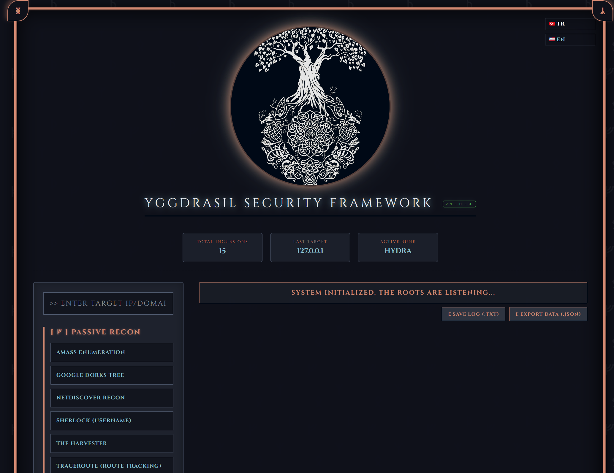
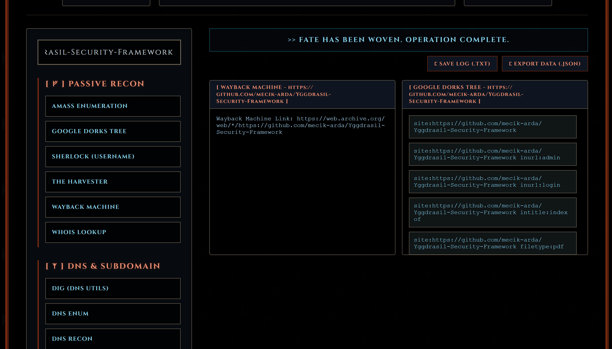

# ᚛᚜ Yggdrasil Security Framework ᚛᚜




This repository features an advanced security reconnaissance and vulnerability assessment framework developed to centralize offensive security operations. It integrates industry-standard tools into a unified, Norse-themed dashboard to streamline the information gathering and exploitation phases of a penetration test.

## Project Reflection & Technical Q&A

### 1. Why did I write the code this way? (XYZ Analysis)
* My objective was to eliminate the inefficiency of switching between multiple command-line tools during a security audit. 
* I accomplished a centralized, web-based management system as measured by reducing tool initialization and reporting time by integrating a Python Flask backend with a dynamic Runic Dashboard. 
* This ensures that reconnaissance data is visualized and logged in real-time within a cohesive operational environment.

### 2. What challenges did I face?
* **Subprocess Management**: Handling multiple concurrent security tools required a robust subprocess execution logic to prevent the Flask backend from hanging during intensive scans.
* **Dependency Orchestration**: I implemented a "Runic Installation Ritual" (Automated Dependency Checker) to detect missing system tools and install them dynamically without manual user intervention.
* **Output Streaming**: Implementing the typewriter effect for real-time output rendering was a challenge in managing asynchronous JavaScript data streams within a synchronous HTML environment.

### 3. How did I manage the Security Arsenal?
* **Modular Integration**: I architected a modular command execution engine that handles specialized flags for Nmap, Sqlmap, Nikto, and WPScan to ensure optimal scan accuracy.
* **Artifact Logging**: The framework includes a reporting module that sanitizes terminal output and exports it into structured TXT or JSON artifacts for professional security documentation.

---

## ᚛᚜ Complete Integrated Arsenal & Features ᚛᚜

The Yggdrasil Security Framework integrates **25 core features and modules** divided into 7 distinct tactical categories:

| Runic Category | Tool Name | Description | Target Req. | OS Support | Command / Handler |
| :--- | :--- | :--- | :---: | :---: | :--- |
| **Passive Reconnaissance (ᚠ)** | WHOIS Lookup | Domain registration information retrieval | Yes | Linux/Win | `whois {target}` |
| | The Harvester | Email, subdomain, and host intelligence gathering | Yes | Linux/Win | `theHarvester -d {target} -l 100 -b all` |
| | Amass Enumeration | Deep open-source subdomain scanning | Yes | Linux/Win | `amass enum -d {target} -passive` |
| | Sherlock | Search social accounts by username | Yes | Linux/Win | `sherlock {target} --timeout 5` |
| | Google Dorks Tree | Interactive dork search links (admin/login/indexes/PDFs...) | Yes | Custom | `generate_dorks` handler |
| | Wayback Machine | Query archive.org for past URLs and cached endpoints | Yes | Custom | `wayback` handler |
| **DNS & Subdomain (ᛉ)** | DNS Enum | Locate DNS records and subdomains | Yes | Linux | `dnsenum --noreverse {target}` |
| | Subfinder | Fast passive subdomain enumeration | Yes | Linux/Win | `subfinder` handler |
| | Assetfinder | Lightweight subdomain discovery | Yes | Linux/Win | `assetfinder --subs-only {target}` |
| | Fierce | IP block and zone-transfer DNS scanner | Yes | Linux/Win | `fierce --domain {target}` |
| | Knockpy | Brute-force DNS subdomain scanner | Yes | Linux/Win | `knockpy` handler |
| | Gobuster DNS | Fast brute-force subdomain discovery | Yes | Linux/Win | `gobuster_dns` handler |
| | Nslookup | Built-in DNS query utility | Yes | Linux/Win | `nslookup -type=any {target}` |
| | Sublist3r | Fast multi-engine subdomain enumeration | Yes | Linux/Win | `sublist3r -d {target}` |
| | DNS Recon | Advanced DNS discovery and AXFR query tool | Yes | Linux/Win | `dnsrecon -d {target}` |
| | Dig (DNS Utils) | Direct query utility for DNS records | Yes | Linux/Win | `dig ANY {target}` |
| **Active Scanning (ᛦ)** | Nmap (Full Scan) | Rapid service identification and port scanning | Yes | Linux/Win | `nmap -sV -F --version-light {target}` |
| | WAF Detection | Detect and identify Web Application Firewalls (Wafw00f) | Yes | Linux/Win | `wafw00f {target}` |
| | Packet Sniffer | Capture network traffic using live Tshark stream | Yes | Linux/Win | `tshark -c 5 -i any` |
| | Nikto Web Scan | Scan target web servers for dangerous files and outdated software | Yes | Linux | `nikto -h {target} -Tuning 1` |
| | WPScan | WordPress vulnerability enumeration & user scan | Yes | Linux | `wpscan --url {target} --enumerate p --random-user-agent` |
| **Vulnerability (ᛟ)** | Exploit-DB Search | Offline check for local exploit binaries (Searchsploit) | Yes | Linux | `searchsploit {target}` |
| | Lynis (System Hardening) | Security auditing and system hardening tool | No | Linux | `lynis audit system` |
| | Nuclei (Vuln Scanner) | Fast and customizable vulnerability scanner | Yes | Linux/Win | `nuclei -u {target}` |
| | Wapiti (Web Scanner) | Web application vulnerability scanner | Yes | Linux/Win | `wapiti -u {target}` |
| | Nmap (CVE Vulners) | Nmap scan using Vulners script | Yes | Linux/Win | `nmap -sV --script vulners {target}` |
| | Hydra (Brute Force) | Parallelized network login cracker | Yes | Linux/Win | `hydra_bruteforce` handler |
| | Sqlmap | Automate detection and exploitation of SQL injection | Yes | Linux/Win | `sqlmap -u {target} --batch --banner` |
| | Commix | Automated command injection vulnerability scanner | Yes | Linux/Win | `commix --url {target} --batch` |
| **Erebus Scanner (Rust) (ᛥ)** | Erebus Scanner | Multi-threaded port scanner with banner grabbing, proxy routing, and IDS evasion | Yes | Linux/Win | `cargo run --manifest-path Runes/erebus-scanner/Cargo.toml` |
| **Kali Ghost Scripts (ᚷ)** | MAC Değiştir | Spoof network interfaces with random MAC | No | Linux | `bash Runes/mac_degistir.sh` |
| | Kimlik Sorgula | Query current public metadata & geolocate | No | Linux | `bash Runes/sorgula.sh` |
| | Yeni IP (Tor) | Renew active IP addressing on Tor circuits | No | Linux | `bash Runes/yeni_ip.sh` |
| **Advanced SYN Scanning (ᛋ)** | Advanced SYN Scan | High speed custom TCP SYN port scanner | Yes | Linux | `Runes/Advanced-SYN-Scanner/syn_scanner` |
| **GUI Traffic Analyzer (ᛈ)** | Launch GUI Sniffer | Maven-compiled JavaFX graphic packet analysis UI | No | Linux/Win | `mvn javafx:run` (in sniffer dir) |
| **Mimir Scanner (ᛗ)** | Mimir Scanner | Real-time network traffic analyzer (Java Spring Boot + React) | No | Linux/Win | `mimir_scanner` handler |
| **SnoopDork OSINT V3 (ᛞ)** | Launch SnoopDork OSINT | Dynamic Target-Oriented OSINT Dork Generator | No | Linux/Win | Browser-based GUI |
| **Packet Injector (ᛇ)** | Packet Injector | Raw packet crafter, TCP SYN/ARP injector, and sniffer engine | Yes | Linux | `sudo python3 Runes/packet-injector/main.py` |
| **Bifrost Gateway (ᛒ)** | Bifrost Gateway | High-performance, cybersecurity-focused API Gateway built with Spring Boot | No | Linux/Win | `mvn spring-boot:run` (in bifrost dir) |
| **System Operations (⚙️)** | Sync All Runes | Synchronize local tool repos with upstream GitHub releases | No | Custom | `update_modules` handler |

---

## ᛝ Custom Integrations (My Runes)

We have expanded the framework with specialized, custom-built tools compiled under the **Runes** directory:

1. **Erebus Scanner (Rust):** An advanced, highly concurrent network scanner written in Rust. Features a dedicated UI Modal for deep configuration:
   * **Port Ranges & Randomization:** Evade basic IDS logic by scrambling ports.
   * **Banner Grabbing & Vulnerability Checking:** Instantly identify services and check CVE logs.
   * **Adaptive Rate Limiting:** Dynamically throttle connection speeds to avoid triggering network firewalls.
   * **Proxy Support:** Route scans seamlessly through Tor or SOCKS5 proxies.
2. **Kali Ghost Scripts:** Essential networking manipulation tools fully integrated into the dashboard (MAC changer, Public IP lookup, IP renewal for Tor nodes).
3. **Advanced SYN Scanner:** Configurable SYN port scanner offering automated and manual modes with custom source/target routing directly from the web interface.
4. **GUI Sniffer (JavaFX & Maven):** A cross-platform GUI Packet Sniffer built in Java, tracking packet lengths, protocols, source/destination IPs, and network activity.
5. **SnoopDork V3:** A dynamic, target-oriented OSINT Dork generator that operates entirely client-side. Generates comprehensive queries for Google, Shodan, GitHub, Pastebin, and more, complete with a stealth mode for privacy.
6. **Packet Injector:** Advanced raw socket packet crafter and injector tool. Supports TCP SYN injection, ARP Poison crafting, operation rate limits, bursts, and standalone packet sniffing/ARP detection on raw ethernet interfaces.
7. **Mimir Scanner:** A full-stack Real-time Network Traffic Analyzer. Uses a Spring Boot backend with pcap4j and GeoIP2 mapping to capture packets, delivering real-time flows to a React frontend via WebSockets.
8. **Bifrost Gateway:** A high-performance, cybersecurity-focused API Gateway built with Spring Boot. Operates as a stateless security intermediary intercepting malicious traffic. Features a robust WAF (Mjolnir) capable of inspecting Request Bodies (JSON/XML) and Headers, along with DoS protection utilizing Caffeine Cache for rapid IP eviction and token-bucket rate limiting.
9. **Dependency Manager (Runic Installation Ritual):** Scans the host system for missing dependencies (Nmap, Sqlmap, Cargo, Maven, etc.) and provides a one-click automated installation across Linux and Windows environments through consecutive animated terminal outputs.

---

# ᚛᚜ System Manual & Deployment ᚛᚜

## Installation Guide

Since the custom **Runes** are integrated as Git Submodules, make sure to clone the repository recursively so that all modules are loaded:

```bash
# Clone the repository along with all custom submodules
git clone --recurse-submodules https://github.com/mecik-arda/Yggdrasil-Security-Framework.git
cd Yggdrasil-Security-Framework
```

*If you already cloned it without `--recurse-submodules`, run the following commands to download the submodules:*
```bash
git submodule update --init --recursive
```

### Environment Setup
Ensure Python 3.x and Flask are installed in your realm. You can use the included virtual environment scripts:

**On Linux/macOS:**
```bash
chmod +x run.sh
./run.sh
```

**On Windows:**
```cmd
run.bat
```

*Or manually:*
```bash
pip install -r requirements.txt
python app.py
```

---

## ᚦ Usage Protocol

1. **Step 1**: Enter the target's IP address or Domain in the central input field.
2. **Step 2**: Select a specific "Rune" (Tool) from the sidebar categories.
3. **Step 3**: Monitor the "Status Bar" for system feedback and the "Output Area" for live results.
4. **Step 4**: Once the operation is complete, use the Artifact Export buttons to secure your findings.

---

## Disclaimer
This framework is developed for educational purposes and authorized penetration testing only. The author is not responsible for any misuse of this tool.

## License
This project is licensed under the MIT License - see the LICENSE file for details.

---
**Author**: Arda Meçik  
**Position**: Computer Engineering Student at Trakya University  
**Student ID**: 1241602620

